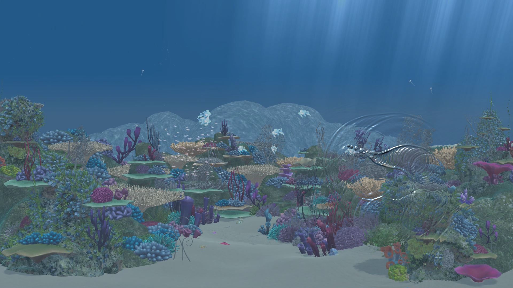

# Unity-Wave-Propagation

The shader code is converted from Wave Propagation Effect (https://www.shadertoy.com/view/Xsd3DB) created by [tomkh](https://www.shadertoy.com/user/tomkh) on Shadertoy.

If you want to deactivate the mouse interaction, just hit the spacebar.

Video on YouTube(https://youtu.be/rK5AAb-1pgE)